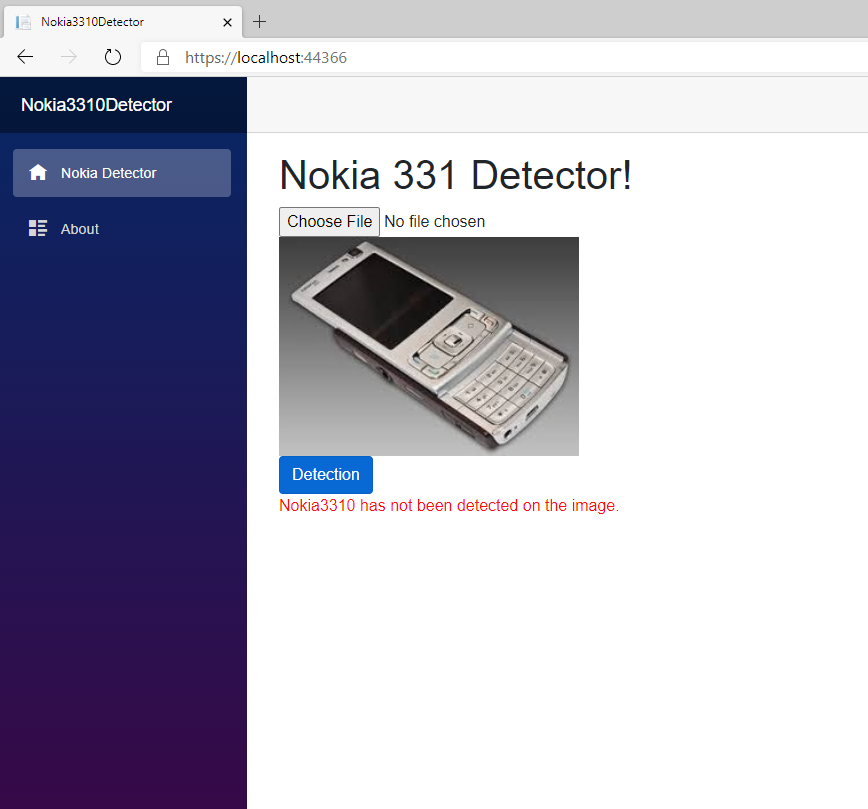
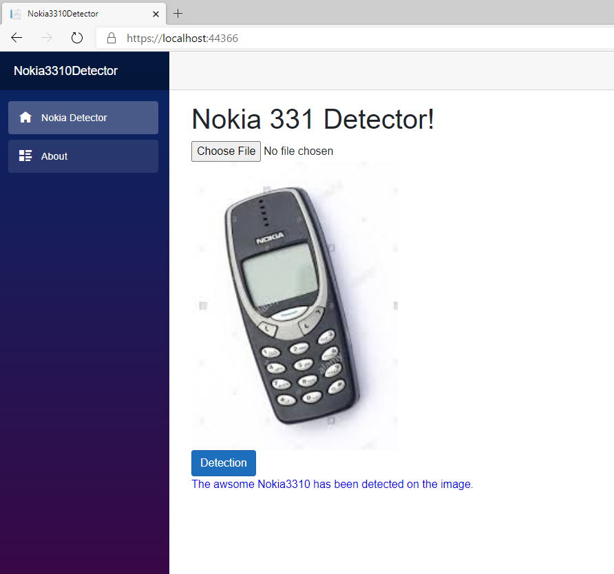

# Detector
Simple Blazor App based on ML.NET capable to detect Nokia3310 legendary phone on image. The App is first used as demo presentation at the meetup `MAchine Learning on .NET - Getting Started` organized by several Meetup groups in Austria, Croatia, and other neighborhood counties:
-  [Meetup of .NET Developer Group in Graz](https://www.meetup.com/MicrosoftDeveloperGraz/events/270366373/).
- [Meetup of Developer Group in Rijeka](https://www.meetup.com/Microsoft-Developer-User-Group-Rijeka/events/270645250/).
- Members of other meetup groups from Sarajevo, Banjaluka, Bihac, ...

# How the Detector is implemented.

The solution looks like very often scenario where you as a .NET Developer need to implement the ML solution into your existing or new .NET project. So the ```Blazor App``` is your standard .NET project (WinForms, WPF, WebApp ...) app that you asked to implement ML solution. The task for you to develop a machine learning model in order to detect ```Nokia 3310``` legendary phone from loaded image.

Within the solution the following projects are implemented:

- ```Nokia3310.Detector.App``` - Blazor App the application which consumes the ML model.
-˛```Nokia3310.ModelTrainer``` - Console App for building, training and preparing the images and model.
- ```Nokia3310.ML.Shared``` - .NET Standard library which shares the implementation needed for both projects.

# The Workflow of the ML solution

The image below show the Workflow and the implementation of the solution:


Blazor App is simple application containing of two pages:
    - About
    - Detector (index) page 


# About Blazor page


# Detector Startup page


# Detector Page when the image doesn't contain the phone



# Detector Page when the image contains the phone.



# Trainer APP

The `Nokia3310.ModelTrainer` project contains the code for image preparation and loading into the application memory. The project is clasic console app, capable to train, evaluate and save the model. Once the model is well trained, the zip file is saved on disk, and deployed in the Detector Bazor app.

The Trainer app implements the ML.NET Image Classification machine learning algorithm, that uses Tensorflow pretrained model ```Inception.V3``` and uses `Transfer Learning` in order to train the Nokia3310 model detector.


