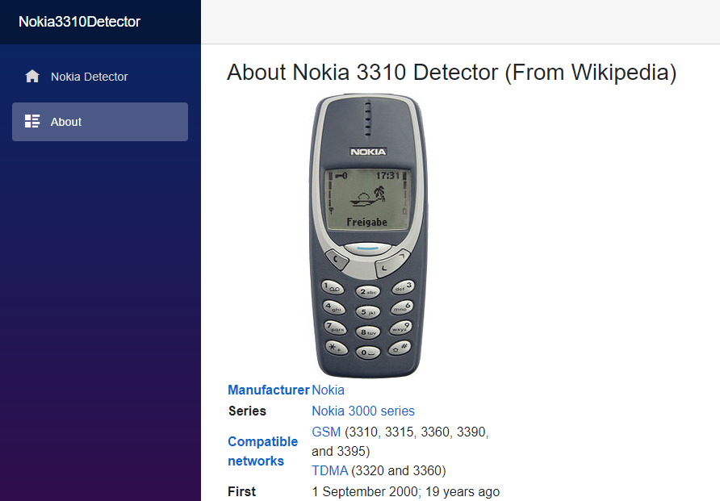
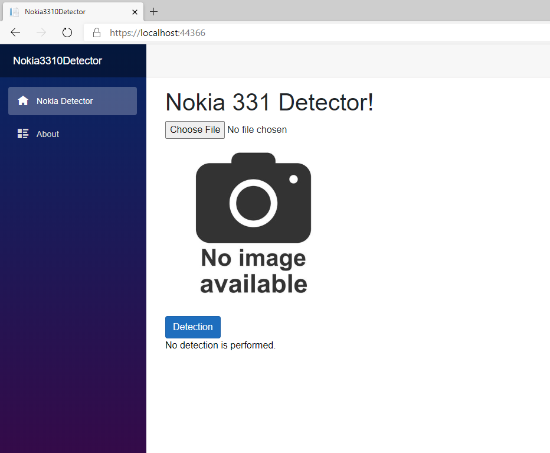

# Detector

`Detector` is .net application that demonstrates how to use different type of `dotnet` components (e.g. `ML.NET`, `Blazor`, `Shared Class Library` and `Web.API`).


 The high-level architecture diagram of the application is shown on the following image:


# Shared Library

The component shares the common code across all components:
- DTO data transformation objects
- Model - EF model 
- Interfaces for different types in order to implement software patterns e.g. repository, mediator, etc.

# Web API 

Web API `Detector` is based on the latest design pattern for building Web API based services called `Minimal API`. The pattern simplifies the implementation of the several very important parts of every Webapplications: 

 - authentications and authorizations
 - middleware, mapping and routing in Web APi,
 - Mediator pattern and CQRS implementation in Web API,
 - Unit and intergation tests

# Machine Learning Part

The machine larning part is based on console application that implements `image classification` using `ML.NET` and `Tensforflow.NET`. The application uses `Inceptionv3` pretrained model from the official `tensorflow` site 


The solution looks like very often scenario where you as a .NET Developer need to implement the ML solution into your existing or new .NET project. So the ```Blazor App``` is your standard .NET project (WinForms, WPF, WebApp ...) app that you asked to implement ML solution. The task for you to develop a machine learning model in order to detect ```Nokia 3310``` legendary phone from loaded image.

Within the solution the following projects are implemented:

- ```Nokia3310.Detector.App``` - Blazor App the application which consumes the ML model.
-˛```Nokia3310.ModelTrainer``` - Console App for building, training and preparing the images and model.
- ```Nokia3310.ML.Shared``` - .NET Standard library which shares the implementation needed for both projects.

# The Workflow of the ML solution

The image below show the Workflow and the implementation of the solution:


Blazor App is simple application consists of two pages:
    - About
    - Detector (index) page 


# About Blazor page




# Detector Startup page




# Detector Page when the image doesn't contain the phone


# Detector Page when the image contains the phone.


# Trainer APP

The `Nokia3310.ModelTrainer` project contains the code for image preparation and loading into the application memory. The project is clasic console app, capable to train, evaluate and save the model. Once the model is well trained, the zip file is saved on disk, and deployed in the Detector Bazor app.

The Trainer app implements the ML.NET Image Classification machine learning algorithm, that uses Tensorflow pretrained model ```Inception.V3``` and uses `Transfer Learning` in order to train the Nokia3310 model detector.


